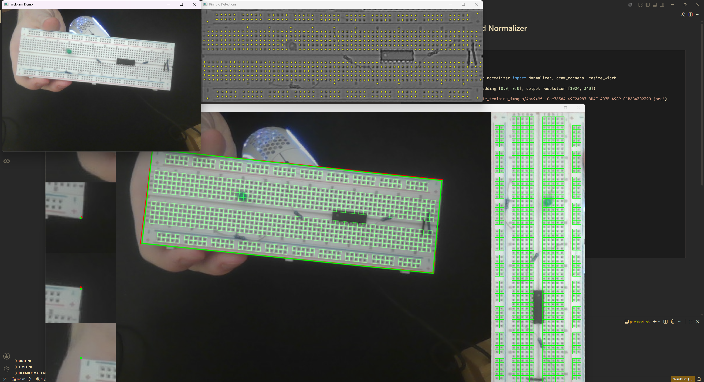
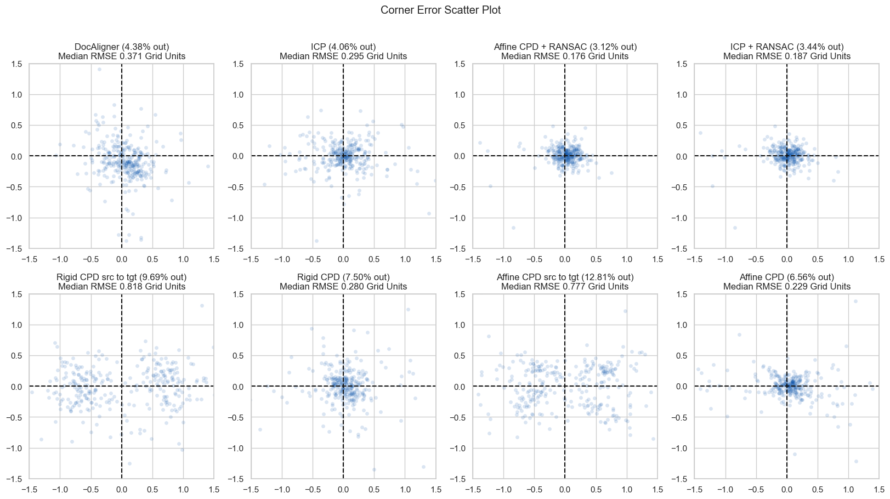

# Stage 2: Breadboard Normalizer

The core of the code for this stage is `normalizer.py` in the breadboard_normalizer python project.

There are also acompanying Jupyter Notebooks which generate visualizations and evaluate the results on our dataset.

`normalizer.py` contains two classes:

## PinGrid

Represents the grid of pinholes on a breadboard. It contains:
- A list of idealized pinhole positions and their labels
- Functions to fit a point cloud to the idealized pinhole positions
- A function to find the closest sub-grid and x, y pair to a given query position
  - i.e. `("rail_top", 14, 0)`
- Constants and utility functions for working with points

## Normalizer

Responsible for normalizing input images such that the pin grid is the same for all images after normalization. Key methods:
- `normalize_image()`
  - The main public API of this project
  - Takes an image of a breadboard as input
  - Returns the normalized image, the detected corner positions, and a confidence level
- `find_circles`
  - Takes a roughly normalized image and returns a list of detected pinhole positions
  - Uses OpenCV to look for dark circles in the image
- `find_refinement_transform`
  - Takes a roughly normalized image and returns a refinement transform to align it with the template
  - Uses `find_circles` to find the pinholes
  - Uses the requested `PinGrid` refinement method to align the detected pinholes to the template and return the corresponding transform
- `breadboard_orientation_cv`
  - Takes a normalized image of a breadboard and determines its orientation
  - Based on finding lengthwise red/blue lines
    - Depends on the breadboard having a red positive rail to the left of a blue negative rail
    - Seems to work OK on the images we tested but sensitive to poor alignment, glare, and heavy occlusions by red/blue wires


## Usage:

```python
import numpy as np
from PIL import Image

from breadboard_normalizer.normalizer import Normalizer

normalizer = Normalizer()

image = Image.open('demo_images/train_medium.jpeg')
image = np.asarray(image)

norm, source_corners, conf = normalizer.normalize_image(image)

```

Visualize the results:
```python
from breadboard_normalizer.normalizer import PinGrid, draw_corners, resize_width
import cv2

annotated = draw_corners(image, source_corners)
annotated = resize_width(annotated, norm.shape[1])

# draw the target pin grid over the top of the image
target = np.zeros_like(norm)
for x, y in normalizer.pingrid.points.astype(int):
    s = int(np.mean(normalizer.pingrid.pitch) / 2) # default normalized dimensions keep grid spacing square
    target = cv2.rectangle(target, (x - s, y - s), (x + s, y + s), (1, 1, 1), 1)

target = (norm * (1 - target) + target * np.array([0, 255, 0])).astype(np.uint8)

stacked = np.vstack([annotated, target])

# cv2 assumes BGR
stacked = np.flip(stacked, axis=-1)
cv2.imshow("demo", stacked)
cv2.waitKey(0)
cv2.destroyAllWindows()
```

# Notebooks:


## `demo.ipynb`:

Contains the usage code from above, as well as a demo that visualizes the model on a freeze-frame of a webcam feed. 

Usage:

- Set the appropriate webcam ID (probably 0)
- Run the `webcam_offline_demo(webcam_id)` line
- Press 's' to freeze the webcam feed and visualize the output for that frame




## `bulk_normalize.ipynb`

Just a single function to normalize all images in a folder and write the outputs to another folder


## `cv_experiments.ipynb`

**Included in the root of the google drive folder, not as part of this github repo.**

The bulk of the visualization and testing code for the core normalization pipeline.




# Older Notebooks

## `stage2.ipynb`

**Included in the root of the google drive folder, not as part of this github repo.**

An earlier experiment with training a simple CNN to classify corners as correct, flipped, or obstructed. We did not end up coming back to it, so some of the cells may not work as expected.

## `utils.ipynb`

**Included in the root of the google drive folder, not as part of this github repo.**

Generates the training data for the aforementioned CNN corner classifier. We did not end up coming back to it, so some of the cells may not work as expected.


## `stage2_yolo.ipynb`

**Included in the root of the google drive folder, not as part of this github repo.**

An earlier attempt at fine tuning a YOLO pose model on our data to find the corners of the breadboard rather than relying on DocAligner.


